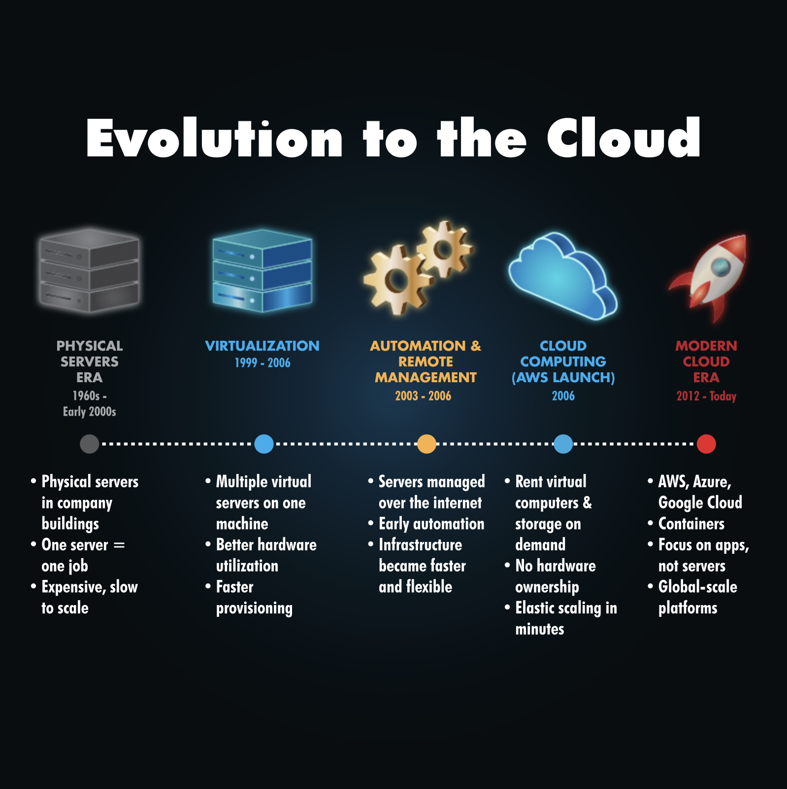

# Computer Fundamental Notes

## Client-Server Model

### HTTP(S)
- Stands for Hypertext Transfer Protocol (Secure)
- It's a stateless client-server protocol used for WWW (World Wide Web)
- Processes each request independantly without storing information
- Session Identifiers are required to store information for the next time the request is made, these are stored in cookies or tokens
- There are 9 core methods to HTTP:
  - GET
  - POST
  - PUT
  - DELETE
  - PATCH
  - HEAD
  - OPTIONS
  - CONNECT
  - TRACE

### GET

The GET method is used to retrieve files from a web server, see above example. 
You can explore the GET method via the inspect tool on most browsers. You will see things like:

## Cloud Computing Fundamentals

Learning Objectives

- What is cloud computing
- Service models of cloud (IaaS, PaaS, SaaS)
- Cloud Types (Private/Public/Hybrid)
- Benefits of cloud computing
- How big companies are using the cloud

